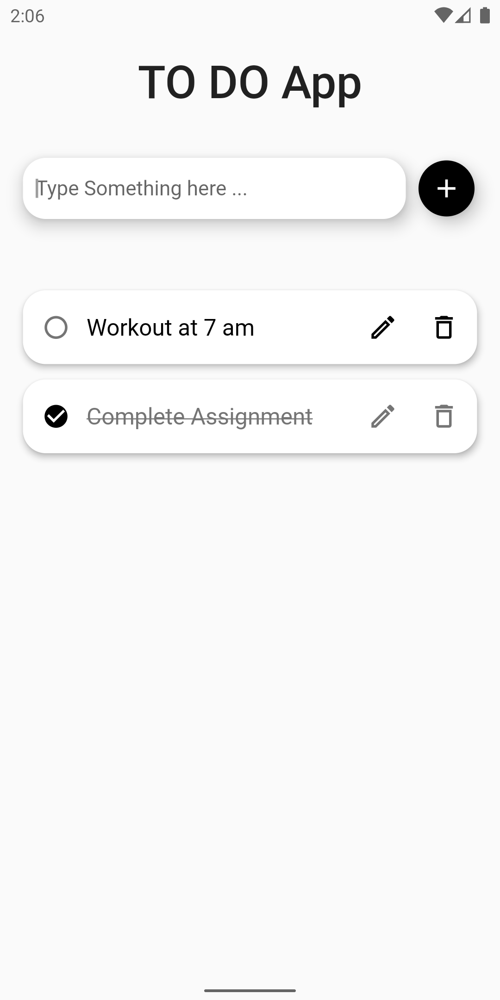

# To Do App

A flutter application that runs on both Android and Web

## Link to Web App
https://softareo-todo-app-assignment.web.app/#/

## Features

- Add a TO-DO Task
- Mark the task as Complete
- Edit the task
- Delete the Task

## Technology Used

- Flutter 
- Firebase

## Screenshots

	
	
	
	
	
	
	

